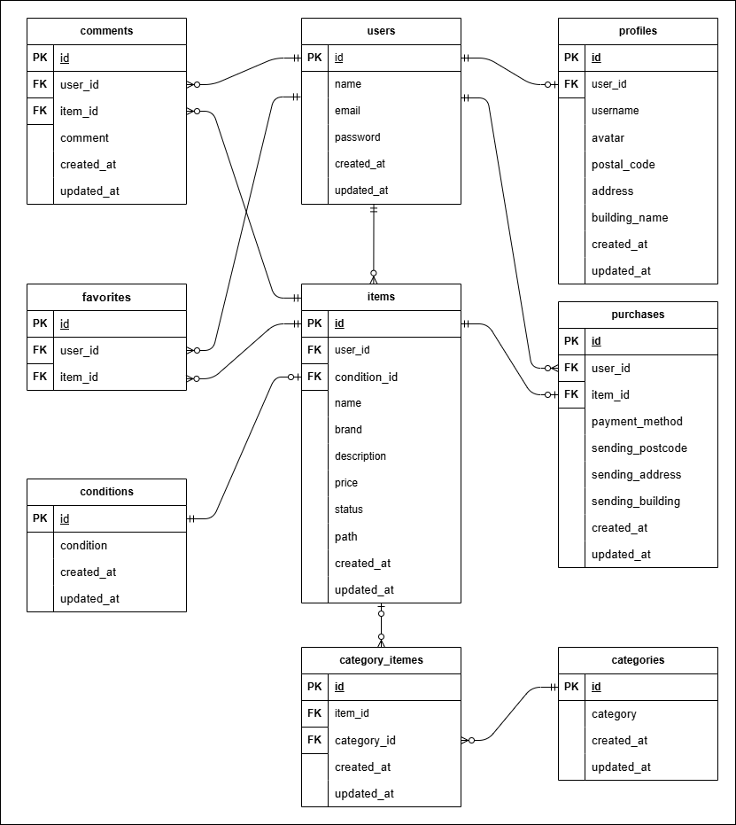

# フリマアプリ

## 環境構築

### Docker ビルド

1. リポジトリをクローン
```bash
git clone git@github.com:tashima-git/market-app.git
```

2. Docker Desktop アプリを起動

3. Docker コンテナをビルドして起動
```bash
docker-compose up -d --build
```

### Laravel 環境構築

1. PHP コンテナに入る
```bash
docker-compose exec php bash
```

2. Composer で依存パッケージをインストール
```bash
composer install
```

3. `.env.example` をコピーして `.env` を作成
```bash
cp .env.example .env
```

4. `.env` に以下の環境変数を設定
```dotenv
DB_CONNECTION=mysql
DB_HOST=mysql
DB_PORT=3306
DB_DATABASE=laravel_db
DB_USERNAME=laravel_user
DB_PASSWORD=laravel_pass

MAIL_MAILER=smtp
MAIL_HOST=mailhog
MAIL_PORT=1025
MAIL_USERNAME=null
MAIL_PASSWORD=null
MAIL_ENCRYPTION=null
MAIL_FROM_ADDRESS="noreply@example.com"
MAIL_FROM_NAME="${APP_NAME}"

<!-- 今回は模擬案件のためskも全て記載 -->
STRIPE_KEY=pk_test_51SCL9kG0hpsOw7pCqsRX7L9Y9bxuNaruC0D24ijAj8SyIEzBcBXPVP82EmWP7d2JwqRRzUU3Q1n1t5ISCeud5lY600QQ8Pj3pq
STRIPE_SECRET=sk_test_51SCL9kG0hpsOw7pCdtWPKqIuI5pLpFCI6qHffxom7wug79In4N1pB2UwqXCoeZlIwU0MaGfJ6TglHPoeO2Eh8CzG00xObcylCS
STRIPE_WEBHOOK_SECRET=whsec_2d82f0f8bbadc4a42f38aeee2c3816ac6ca972d29c8b95c8881badfcb5e28d18

```

5. アプリケーションキーを作成
```bash
php artisan key:generate
```

6. マイグレーションを実行
```bash
php artisan migrate
```

7. シーディングを実行
```bash
php artisan db:seed
```

### テスト環境構築

1. PHP コンテナ内のまま`.env` をコピーして `.env.testing` を作成
```bash
cp .env .env.testing
```

2. `.env.testing` に以下の環境変数を設定
```dotenv
DB_CONNECTION=sqlite
DB_DATABASE=:memory:
<!-- 以下のDB情報は削除する -->
<!-- DB_PORT=3306 -->
<!-- DB_DATABASE=laravel_db -->
<!-- DB_USERNAME=laravel_user -->
<!-- DB_PASSWORD=laravel_pass -->

MAIL_MAILER=smtp
MAIL_HOST=mailpit
MAIL_PORT=1025
MAIL_USERNAME=null
MAIL_PASSWORD=null
MAIL_ENCRYPTION=null
MAIL_FROM_ADDRESS="hello@example.com"
MAIL_FROM_NAME="${APP_NAME}"
```

3. テストを実行する
```bash
php artisan test
```
### stripeを起動し購入処理を可能にする

1. `exit`コマンドでコンテナ内から出る

2. stripeを起動する
```bash
stripe listen --forward-to http://172.24.13.75/webhook/stripe
```

## 使用技術・実行環境

- PHP 8.4.8
- Laravel 10.49.0
- MySQL 8.0.26

## ER図



## URL

- 開発環境: [http://localhost/](http://localhost/)
- phpMyAdmin: [http://localhost:8080/](http://localhost:8080/)
